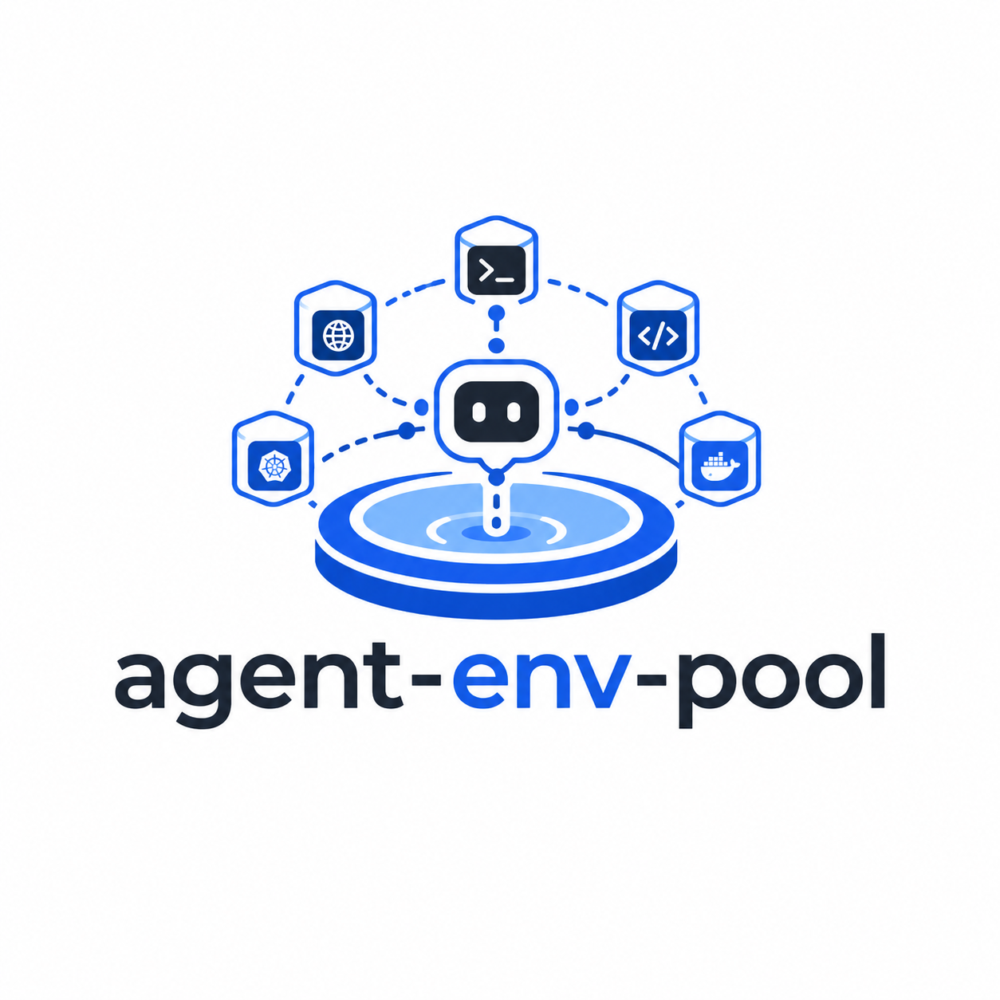
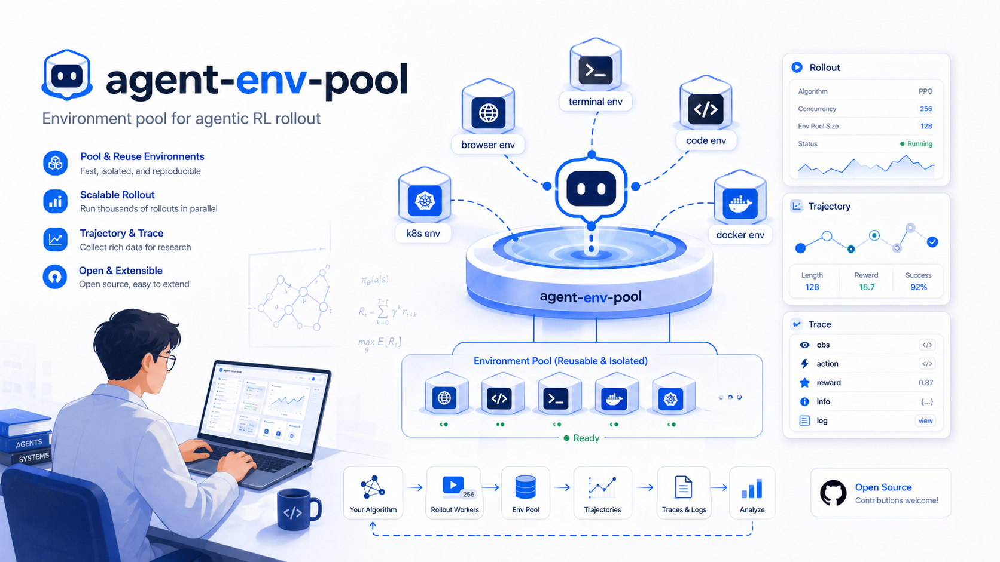

<p align="center">
  
</p>

<h1 align="center">agent-env-pool</h1>

<p align="center">
  Batch-manage Docker containers with one API — boot hundreds of sandboxes, track them, and clean up automatically.
</p>

<p align="center">
  <a href="https://hub.docker.com/r/uvheart280/agent-env-pool"></a>
</p>
<p align="center">
   <a href="./README.zh.md">中文文档</a>
</p>

<p align="center">
  
</p>

---

## Why agent-env-pool?

Running 10 Docker containers is easy. Running 200 — each with different images, ports, health checks, and lifecycle — is not. `agent-env-pool` turns that into a single API call.

**Core advantages:**

- **Any image** — Chrome, Playwright, code-server, VNC desktop, custom ML workers, Agent CLI — if it runs in Docker, agent-env-pool can manage it
- **Batch rollout** — boot N containers in one request, with quota enforcement and automatic port allocation
- **Health-check aware** — built-in CDP / HTTP / TCP readiness probes; your container is ready when the API says "running"
- **Automatic cleanup** — orphan detection, force shutdown, and rollout-level teardown
- **Zero config networking** — ephemeral host ports auto-assigned by Docker, no manual port mapping needed
- **Pool reuse** — acquire/release pattern keeps warm containers for long-running workloads
- **Trace everything** — every API response carries a `trace_id` for debugging

## Use Cases

| Scenario | Image | Endpoint | Why agent-env-pool? |
|---|---|---|---|
| Browser automation at scale | `zenika/alpine-chrome:124` | CDP `:9222` | Boot 50 Chrome instances, each with CDP ready-check, auto-cleanup |
| AI Agent sandboxes | Claude Code / Codex / Gemini CLI | API / stream | Isolated environments per agent session, quota-controlled |
| RL training rollout | custom training image | any | Batch boot training workers, track lifecycle, collect results |
| Playwright / scraping farm | any headless browser | HTTP / WS | Pool reuse across scraping jobs, no port conflicts |
| Code-server / dev envs | `codercom/code-server` | HTTP `:8080` | On-demand dev environments with health checks |
| VNC remote desktop | `dorowu/ubuntu-desktop-lxde-vnc` | TCP / WS | Batch desktop provisioning with auto port assignment |
| CI/CD test matrices | any test image | varies | Spin up test environments in parallel, tear down on completion |

## Installation

### Option A — Docker (recommended)

```bash
docker run -d \
  --name agent-env-pool \
  -p 127.0.0.1:8100:8100 \
  -v /var/run/docker.sock:/var/run/docker.sock \
  --add-host host.docker.internal:host-gateway \
  -e AGENT_ENV_POOL_DOCKER_READY_HOST=host.docker.internal \
  uvheart280/agent-env-pool:latest

export AGENT_ENV_POOL_URL=http://127.0.0.1:8100
```

On shared hosts where `8100` may be taken, use a random port:

```bash
docker run -d \
  --name agent-env-pool \
  -p 127.0.0.1::8100 \
  -v /var/run/docker.sock:/var/run/docker.sock \
  --add-host host.docker.internal:host-gateway \
  -e AGENT_ENV_POOL_DOCKER_READY_HOST=host.docker.internal \
  uvheart280/agent-env-pool:latest

export AGENT_ENV_POOL_URL=http://127.0.0.1:$(docker inspect -f '{{(index (index .NetworkSettings.Ports "8100/tcp") 0).HostPort}}' agent-env-pool)
```

Verify:

```bash
curl "$AGENT_ENV_POOL_URL/api/v1/servers"
# {"meta":{"trace_id":"..."},"data":{"items":[],"total":0}}
```

### Option B — From source

```bash
git clone https://github.com/uvheart/agent-env-pool.git
cd agent-env-pool
pip install -r requirements.txt
python -m agent_env_pool --host 0.0.0.0 --port 8100
```

## Quickstart

### Boot a single container

```bash
SERVER=$(curl -s -X POST "$AGENT_ENV_POOL_URL/api/v1/servers/boot" \
  -H 'content-type: application/json' \
  -d '{
    "env_type": "browser-use",
    "image": "zenika/alpine-chrome:124",
    "endpoints": [
      {"name": "cdp", "container_port": 9222, "protocol": "cdp", "ready_check": {"type": "cdp"}}
    ],
    "metadata": {
      "command": ["--no-sandbox", "--remote-debugging-address=0.0.0.0", "--remote-debugging-port=9222", "about:blank"],
      "security_opt": ["seccomp=unconfined"]
    }
  }')

echo $SERVER | python3 -m json.tool
```

### Batch rollout — boot 10 containers at once

```bash
ROLLOUT=$(curl -s -X POST "$AGENT_ENV_POOL_URL/api/v1/rollout/boot" \
  -H 'content-type: application/json' \
  -d '{
    "count": 10,
    "env_type": "browser-use",
    "image": "zenika/alpine-chrome:124",
    "endpoints": [{"name": "cdp", "container_port": 9222, "protocol": "cdp", "ready_check": {"type": "cdp"}}],
    "metadata": {
      "command": ["--no-sandbox", "--remote-debugging-address=0.0.0.0", "--remote-debugging-port=9222", "about:blank"],
      "security_opt": ["seccomp=unconfined"]
    }
  }')

ROLLOUT_ID=$(echo $ROLLOUT | python3 -c "import sys,json; print(json.load(sys.stdin)['data']['rollout_id'])")

# Check rollout status
curl -s "$AGENT_ENV_POOL_URL/api/v1/rollout/$ROLLOUT_ID" | python3 -m json.tool

# Shut down all 10 at once
curl -s -X POST "$AGENT_ENV_POOL_URL/api/v1/rollout/$ROLLOUT_ID/shutdown?force=true"
```

### Use any image

```bash
# Code-server with HTTP health check
curl -s -X POST "$AGENT_ENV_POOL_URL/api/v1/servers/boot" \
  -H 'content-type: application/json' \
  -d '{
    "env_type": "custom",
    "image": "codercom/code-server:latest",
    "endpoints": [
      {"name": "http", "container_port": 8080, "protocol": "http", "ready_check": {"type": "http", "path": "/"}}
    ]
  }'

# Custom ML worker with TCP check
curl -s -X POST "$AGENT_ENV_POOL_URL/api/v1/servers/boot" \
  -H 'content-type: application/json' \
  -d '{
    "env_type": "custom",
    "image": "my-ml-worker:latest",
    "endpoints": [
      {"name": "grpc", "container_port": 50051, "protocol": "tcp", "ready_check": {"type": "tcp"}}
    ]
  }'
```

### Shut down

```bash
SERVER_ID=$(echo $SERVER | python3 -c "import sys,json; print(json.load(sys.stdin)['data']['server_id'])")
curl -s -X POST "$AGENT_ENV_POOL_URL/api/v1/servers/$SERVER_ID/shutdown?force=true"
```

## API Reference

### Core endpoints

| Method | Path | Description |
|--------|------|-------------|
| `POST` | `/api/v1/servers/boot` | Boot a single container |
| `POST` | `/api/v1/servers/{id}/shutdown` | Shut down a container |
| `GET` | `/api/v1/servers` | List all active containers |
| `GET` | `/api/v1/servers/{id}` | Get container detail |
| `GET` | `/api/v1/servers/{id}/logs` | Get container logs |

### Pool (acquire/release)

| Method | Path | Description |
|--------|------|-------------|
| `POST` | `/api/v1/pool/acquire` | Acquire an idle container or boot a new one |
| `POST` | `/api/v1/pool/release/{id}` | Release back to pool |

### Batch rollout

| Method | Path | Description |
|--------|------|-------------|
| `POST` | `/api/v1/rollout/boot` | Boot N containers |
| `GET` | `/api/v1/rollout/{rollout_id}` | Check rollout status |
| `POST` | `/api/v1/rollout/{rollout_id}/shutdown` | Shut down entire rollout |

## Python SDK

```python
from agent_env_pool import EnvPoolClient

pool = EnvPoolClient("http://127.0.0.1:8100")

# Single container
with pool.acquire(image="zenika/alpine-chrome:124", endpoints=[
    {"name": "cdp", "container_port": 9222, "protocol": "cdp", "ready_check": {"type": "cdp"}}
]) as env:
    print(env.cdp_url)  # connect your agent here

# Batch rollout
rollout = pool.rollout_boot(count=20, image="my-worker:latest", endpoints=[...])
print(f"Booted {len(rollout.server_ids)} workers")
pool.rollout_shutdown(rollout.rollout_id)
```

## Lifecycle

```
starting → running → occupied → stopping → stopped
              ↘          ↘          ↘
                        error
```

Quota is enforced atomically via SQLite `BEGIN IMMEDIATE` before container creation begins. `starting`, `running`, `occupied`, `stopping` all count against the active quota (default: 32).

## Roadmap

| Version | Focus |
|---|---|
| V0.1 | Single-node Docker sandbox pool ✅ |
| V0.2 | Trajectory collection & JSONL export |
| V0.3 | Failure replay & browser action adapters |
| V0.4 | Monitoring UI & operator tooling |
| V0.5 | Kubernetes & distributed scheduling |
